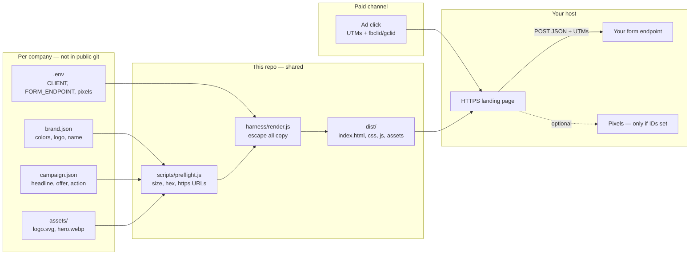
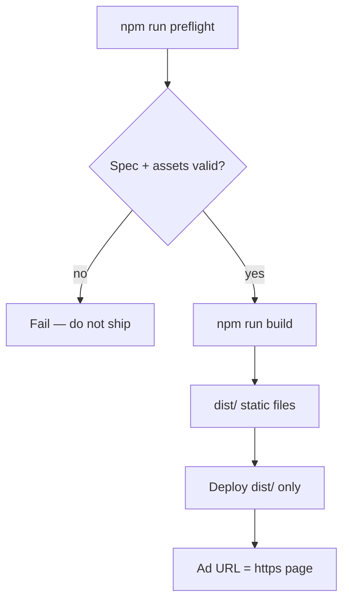

# Landing page harness

Public kit for paid-channel landing pages.

- **Harness** (this repo): speed, layout, devices, UTMs, pixel hooks, safe rendering.
- **Spec** (`clients/<name>/`): brand, copy, action, assets.

No production npm dependencies. Clone, copy `.env.example` → `.env`, run locally.

## Can you use it immediately?

**Demo: yes.** Clone, `cp .env.example .env`, `npm run dev`. The `_example` page runs locally with no pixels and no form backend.

**Paid traffic: not until you add a spec and a host.** The harness is the runtime. A live campaign still needs:

| Ready now | You add per campaign |
| --- | --- |
| Layout, escape, UTM fields, preflight, static build | `clients/<name>/brand.json` + `campaign.json` |
| Example assets | Real logo + compressed hero |
| Form UI + honeypot | `FORM_ENDPOINT` you control (CORS + rate limit) |
| Pixel hooks (off when blank) | IDs in **your** `.env` only |
| `dist/` + security headers | HTTPS host (Cloudflare Pages, etc.) |

Do not point ads at the example page. Do not commit real client folders or `.env`.

## Architecture

Shared runtime on the left. Per-company spec on the right. Secrets never enter git.



Build path:



## Quick start

```bash
git clone https://github.com/Seeking-Leverage/landing-page-harness.git
cd landing-page-harness
cp .env.example .env
# Node 18+
npm run dev
```

Open http://127.0.0.1:4173

Build static files to `dist/`:

```bash
npm run build
```

Host `dist/` on Cloudflare Pages, Netlify, GitHub Pages, or any static host. Use HTTPS.

## Add a client

```bash
cp -r clients/_example clients/acme
```

Edit:

- `clients/acme/brand.json` — colors, name, logo alt
- `clients/acme/campaign.json` — headline, offer, CTA, form fields
- `clients/acme/assets/` — `logo.svg`, `hero.webp` (or `.svg` / `.jpg`), optional `og.jpg`

Set in `.env`:

```
CLIENT=acme
FORM_ENDPOINT=https://your-endpoint.example/lead
```

Then `npm run preflight` and `npm run dev`. Keep `clients/acme` out of the public fork.

## What is shared vs per company

| Shared (harness) | Per company (spec) |
| --- | --- |
| Performance, responsive layout | Brand tokens |
| Device / in-app browser CSS | Copy and offer |
| UTM + click-id capture | Primary action |
| Escape + URL checks | Assets |
| Pixel loaders (off until IDs set) | Pixel IDs in **your** `.env` |

## Security

Read [SECURITY.md](SECURITY.md). Short version:

- Never commit `.env` or real client folders
- `FORM_ENDPOINT` must be an endpoint **you** control
- Campaign text is escaped; do not render it as HTML
- Pixels stay off when IDs are blank

## Go live

See [docs/GO-LIVE.md](docs/GO-LIVE.md).
