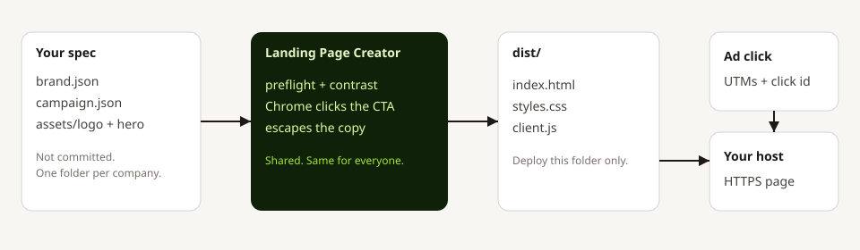
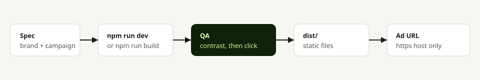

# Landing Page Creator

Clone this, point it at a brand, and get a static landing page you can host. It is for paid traffic: one offer, one action, fast on a phone and inside Instagram or Facebook.

The shared code is the same for every company. What changes is a folder: colors, logo, headline, and the button. Secrets stay in `.env` on your machine.

No production npm dependencies. Node 18 or newer.



## What you get

| Included | You still add |
| --- | --- |
| A single-column page that widens on desktop | The words that match the ad |
| Logo and hero slots, size-capped | The real logo and a compressed hero |
| UTM, `fbclid`, `gclid`, and `ttclid` captured on the form | A form endpoint you control |
| Meta, Google Ads, and TikTok hooks, off until you set IDs | Those IDs, in `.env` only |
| Contrast check, then a real Chrome window that clicks the button | A look at the page on a phone before you spend |
| `dist/` plus security headers | An HTTPS host |

Do not send ads to the example page. Do not commit a real client folder or `.env`.

## Use it

```bash
git clone https://github.com/Seeking-Leverage/landing-page-creator.git
cd landing-page-creator
cp .env.example .env
npm run dev
```

Open http://127.0.0.1:4173

`npm run dev` and `npm run build` run QA first. If the button label cannot be read, or Chrome cannot click it, the page does not start. Details: [docs/QA.md](docs/QA.md).

If you already cloned this when it was named `landing-page-harness`, `git pull` still works. GitHub redirects the old URL. To point the remote at the new name:

```bash
git remote set-url origin https://github.com/Seeking-Leverage/landing-page-creator.git
```

## Make a page for one company

```bash
cp -r clients/_example clients/acme
```

Edit:

- `clients/acme/brand.json` — name and the five colors. `accentFg` is the button label. It must contrast with `accent`.
- `clients/acme/campaign.json` — headline, offer, and the one action.
- `clients/acme/assets/logo.svg` — the logo. PNG or WebP is fine. Keep it under 40 KB.
- `clients/acme/assets/` — the hero named in `campaign.json`. Under 200 KB.

In `.env`:

```
CLIENT=acme
FORM_ENDPOINT=https://your-endpoint.example/lead
```

Then `npm run dev`. Leave `clients/acme` out of git. Only `clients/_example` is public.

### Draft a brand from a public URL

This reads design tokens and, when it can, a small same-site logo. It does not copy fonts or photography, and it refuses private or local addresses.

```bash
npm run brand -- https://client-site.com --name acme
CLIENT=acme npm run dev
```

Check the colors. A site with no tokens comes back as a guess. The accent often comes from `theme-color`, not the real button.

## How wide the page is

Phones already use the screen. Desktop width is `--max` in [harness/styles.css](harness/styles.css):

| Window | Column |
| --- | --- |
| Under 800px | 40rem |
| 800px and up | 68rem |
| 1200px and up | 80rem |

Change those three values if a brand should be narrower. Restart dev after you edit the file.

## Ship it



```bash
npm run build
```

Host the `dist/` folder on Cloudflare Pages, Netlify, GitHub Pages, or any static host. HTTPS only. The checklist is [docs/GO-LIVE.md](docs/GO-LIVE.md).

Pixels stay off until `META_PIXEL_ID`, `GOOGLE_ADS_ID`, or `TIKTOK_PIXEL_ID` is set in `.env`. A lead event fires when the form succeeds, not when the page loads.

## What is shared

| Shared, in this repo | Per company, on your machine |
| --- | --- |
| Layout, speed, escaping | Colors, logo, name |
| Device width | Headline and offer |
| UTM and click-id fields | The one action |
| URL and contrast checks | Assets |
| Pixel loaders | Pixel IDs |

`harness/` is that shared runtime. You should not need to edit it for a normal page.

## Security

[SECURITY.md](SECURITY.md). Short version: your form endpoint, your pixel IDs, and your client folders stay local. Campaign text is escaped. `npm run brand` only fetches public https URLs.
